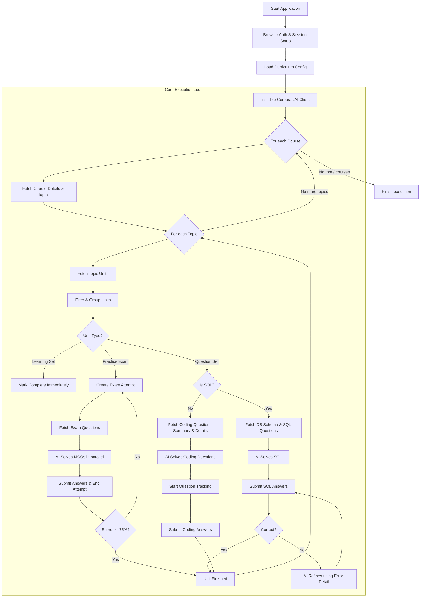

# NiatButtCracker (CCBP Auto-Solver)

An advanced, AI-powered automation CLI designed to automatically solve and complete CCBP/NXT Wave learning platform courses. It mimics human behavior, intelligently bypasses rate limits, handles various question formats (MCQs, Coding, SQL), and completes all curriculum requirements asynchronously.

---

## 🏗️ High-Level Architecture

The architecture consists of three primary modules operating in a robust loop:
1. **Core Loop / Runner (`runner.ts`)**: Iterates through courses, topics, and individual learning units.
2. **API Client (`api.ts`)**: Interfaces with the CCBP internal backend APIs with session simulation.
3. **AI Solver Engine (`solver.ts` & `solver-interface.ts`)**: Parses question structures, connects with Cerebras Cloud (using models like `gpt-oss-120b`, `qwen-3-235b-a22b-instruct-2507`, or `llama3.1-8b`), and generates highly accurate solutions.

### 🔄 The Execution Loop Diagram

The following diagram illustrates the flow of execution from start to finish:

---

## ⚙️ How Everything Works (Start to Finish)

### 1. Authentication & Setup (`index.ts` / `browser-auth.ts`)
When the CLI runs, it pulls credentials and triggers a hidden Playwright browser to log into the CCBP portal. It grabs the active session token to be used across all internal API endpoints. 

### 2. The Runner Loop (`runner.ts`)
The execution loops via an asynchronous concurrency limiter (to avoid being IP banned). 
* **Courses Loop:** Given the chosen configuration, it runs through the `processCourse` function.
* **Topics Loop:** Fetches the list of topics inside the course.
* **Units Grouping:** A single topic comprises various "Units" (Learning sets, Practice exams, Question sets). They are grouped and processed using different concurrency queues:
   * **Learning Sets** (Concurrency: 8) - Instantly bypassed.
   * **Practice Sets** (Concurrency: 3) - Uses exam simulations.
   * **Question Sets** (Concurrency: 2) - Hard coding/SQL tasks.

### 3. Solving Different Unit Types
#### 🟢 Learning Sets
Simple reading/video materials. The script automatically hits the completion endpoint and marks it done.

#### 🟡 Practice Sets (MCQs)
1. Initiates an `exam_attempt` with CCBP APIs.
2. Extracts all multiple-choice questions.
3. Batches these to the AI Solver. The LLM is instructed to reason and pick an A/B/C/D option.
4. Maps the AI's choice to the UUID option IDs.
5. Emulates time delays (`time_spent`) to appear human.
6. Submits all answers and evaluates the score. If `< 75%`, it automatically retries the attempt.

#### 🔴 Question Sets (Coding & SQL)
These are evaluated via strict test cases.
* **SQL Flow**: 
  1. The AI is fed the precise SQLite schema (dynamically fetched/downloaded from the platform's `db_url`).
  2. The AI writes the SQL query. 
  3. If the server evaluates the SQL as `INCORRECT`, the script captures the raw database error message (e.g., mismatched columns, missing data) and feeds it back to the AI for a **self-refining retry loop** (up to 5 attempts).
* **Coding Flow**: 
  1. Pulls question descriptions, test cases, and the existing code template.
  2. Solves the algorithm in Python, Node.js, C++, or Java.
  3. Submits a double-JSON-encoded payload.

### 4. AI Engine (`solver.ts`)
The intelligence backend relies on Cerebras Cloud to leverage massive open-source models with high inference speed.
* **Model Rotation:** Prevents getting rate-limited by constantly rotating through a list of primary models (`gpt-oss-120b`, `qwen-3-235b...`) and falling back to `llama3.1-8b`.
* **Prompt Engineering:** Tailors prompts based on the context. For instance, in C++ coding questions, the AI is heavily instructed not to include an `int main()` block since the judge system tests against class instances.

---

## 🔌 API Endpoints Hit

The CLI essentially reverse-engineers and consumes the CCBP internal frontend API wrapper (`https://nkb-backend-ccbp-prod-apis.ccbp.in`).

> **Note on Payloads:** All payloads sent to CCBP are peculiarly double-encoded. The internal JSON must be stringified, injected into another JSON `{ "data": "..." }`, and sent with `clientKeyDetailsId: 1`.

### Course & Topic Discovery
* `POST /api/nkb_resources/user/course_details/v4/` - Fetch course metadata and topic lists.
* `POST /api/nkb_resources/user/topic/units_details/v3/` - Fetch all units for a given topic.

### Learning Sets
* `POST /api/nkb_learning_resource/learning_resources/set/complete/` - Silently marks videos/reading materials as complete.

### Practice / Exam Sets
* `POST /api/nkb_exam/user/exam/exam_attempt/` - Initializes a new exam instance.
* `POST /api/nkb_primitive_coding/user/exam_attempt/primitive_coding/questions/` - Pulls MCQs.
* `POST /api/nkb_primitive_coding/user/exam_attempt/primitive_coding/submit/` - Submits all chosen answers.
* `POST /api/nkb_exam/user/exam_attempt/end/` - Ends the attempt cleanly.

### Coding Questions
* `POST /api/nkb_coding_practice/user/coding/questions/summary/` - Gets a summary of coding questions for a unit.
* `POST /api/nkb_coding_practice/coding/question/start/` - Starts tracking the coding session.
* `POST /api/nkb_coding_practice/user/coding/questions/` - Fetches code templates, test cases, and problem statements.
* `POST /api/nkb_coding_practice/question/coding/submit/` - Submits source code synchronously.
* `POST /api/nkb_coding_practice/question/coding/submit/v2/` - Submits asynchronously (for languages taking longer to compile).

### SQL Questions
* `POST /api/nkb_coding_practice/questions/sql/v1/` - Fetches SQL problem statements and default snippets.
* `POST /api/nkb_coding_practice/questions/sql/submit/v1/` - Submits SQL statements for query validation.
